# Collet Next: a local-first execution fabric for large AI and search data jobs

## Why revive Collet

Collet should not return as another general-purpose ETL scheduler or conversational-agent framework. Its useful niche is reliable execution of large, expensive, data-oriented jobs that combine conventional processing with models, search systems, and external APIs.

The reference workload is intentionally demanding:

- discover and parse terabytes of profiles or documents;
- normalize and deduplicate records;
- enrich records through APIs and language models;
- generate embeddings in bounded batches;
- build and validate a Solr index;
- calculate features, score candidates, and evaluate rerankers;
- repeat only the affected work after data, code, prompt, or model changes;
- explain cost, failures, lineage, and operational bottlenecks.

The intended product is:

> A local-first, coordinatorless execution fabric for incremental AI and search data jobs, with durable artifacts, reproducible runs, lineage, and built-in operational evidence.

“Coordinatorless” means there is no dedicated scheduler process assigning work. It does not mean there is no shared coordination state. In a distributed deployment, Datalevin is the authority workers use to discover, claim, and commit work.

## Preserve what is already good

The revival should retain Collet's strongest ideas:

- pipelines are declarative data that can be validated, versioned, diffed, and generated;
- a pipeline is a DAG of tasks;
- a task is an ordered sequence of actions;
- selectors and conditions connect configuration, inputs, and action state;
- actions are small, extensible integration and transformation units;
- virtual threads and bounded concurrency suit I/O-heavy workloads;
- the runtime remains useful as an embedded Clojure library and a local CLI.

Clojure remains the implementation language. It should not remain an adoption requirement: pipeline data, artifact contracts, telemetry, and future worker APIs should be language-neutral where practical. Datalevin 1.0 already exposes local and remote APIs in Clojure, Java, Python, and JavaScript, which removes one database-access barrier for future worker SDKs without defining the Collet worker protocol for us.

## Desired architecture

```mermaid
flowchart TB
    SPEC["Versioned pipeline definition"] --> PLAN["Immutable compiled plan"]
    PLAN --> RUN["Pipeline run"]

    RUN --> DLV["Datalevin 1.x coordination state"]
    DLV <--> CPU["CPU workers"]
    DLV <--> GPU["GPU / model workers"]
    DLV <--> IDX["Index workers"]

    CPU <--> ART["Artifact store: filesystem or S3"]
    GPU <--> ART
    IDX <--> ART
    IDX --> SOLR["Solr / external sinks"]

    CPU --> OTEL["OpenTelemetry"]
    GPU --> OTEL
    IDX --> OTEL
    OTEL --> ABEL["ABEL analysis and remediation proposals"]
    ABEL --> DLV
```



The architecture has four separate concerns:

1. **Definition and planning** — immutable pipeline specifications and compiled plans.
2. **Coordination** — durable run state, task/work-unit state, leases, attempts, and lineage in Datalevin.
3. **Data execution** — bounded Arrow batches, optional DuckDB SQL, and action execution inside workers.
4. **Materialization** — immutable artifacts in a filesystem or object store and idempotent publication to external systems.

None of these layers should become the hidden storage or execution model of another layer.

## Definition and run model

A pipeline definition is immutable and identified by a deterministic content hash. Compiling it produces an immutable execution plan without run IDs, statuses, results, executors, or callbacks.

The plan also gives each task and action a stable semantic fingerprint. A change elsewhere in the pipeline must not invalidate an unaffected task whose inputs and output-affecting definition are unchanged.

Semantic identity is based on a versioned canonical EDN projection, not raw serialization or runtime values. Pipeline schemas and action contracts classify fields as output-affecting or operational. Labels, descriptions, scheduling hints, concurrency, retries, deadlines, and telemetry are normally operational unless an action declares otherwise. Code, plugins, prompts, models, tokenizers, schemas, and other executable dependencies need a stable content hash, immutable version, or digest when they affect output. If Collet cannot classify a field or identify executable content confidently, the task executes but is marked non-reusable with an inspectable reason.

Each execution creates an ownership chain for coordination state, while artifacts
and snapshots remain reusable data objects rather than children owned by one run:

```text
PipelineDefinition → PipelineRun → TaskRun → WorkUnit → Attempt
                                                       │
                                                       └── produces → Artifact

DatasetSnapshot  → contains → SnapshotEntry → resolves to → Artifact
Materialization  → maps exact computation identity → committed Snapshot/Artifact
LineageEdge      → records exact derivation and reuse facts
TaskRun/WorkUnit → reuses → a previously committed Materialization
```

The pipeline DAG should remain small. Large workloads must not create one task entity per profile or document. A task run expands into partition-level work units such as a source byte range, object, Parquet row group, or deterministic hash bucket.

Compiled functions, live connections, executors, and callbacks are process-local and reconstructed by a worker. Durable state contains only serializable identity, lifecycle, policy, error, and reference data.

## Worker model

Workers are replaceable processes with declared capabilities, for example:

```clojure
#{:cpu
  :profile-parser
  [:embedding/model "bge-m3"]
  [:accelerator :cuda]
  :solr-indexer}
```

In the eventual distributed runtime, every worker follows the same pull-based loop:

1. Find ready work matching its capabilities.
2. Atomically claim it with a lease and fencing token.
3. Renew the lease while processing bounded units.
4. Write and validate output artifacts.
5. Commit completion using the current lease token and fence.
6. Make newly satisfied downstream work discoverable.

There is no central scheduler. Claiming, renewal, completion, failure, cancellation, and reconciliation are transactional state operations. Any eligible worker can perform reconciliation.

Execution is **at least once**. Worker death, lease expiry, network partitions, or coordination failover may duplicate computation. Correctness comes from fencing, immutable artifacts, deterministic materialization keys, and idempotent sinks—not from an “exactly once” claim.

## Datalevin's role

Datalevin stores coordination metadata, not workload payloads.

The coordination baseline is [Datalevin 1.0.0](https://github.com/datalevin/datalevin/blob/1.0.0/CHANGELOG.md#100-2026-07-20), released on 2026-07-20. It requires Java 21, which already matches Collet. The release turns several former infrastructure assumptions into available platform capabilities, but it does not remove the need for Collet's own work, artifact, and reconciliation semantics:

| Datalevin 1.0 capability | Collet decision |
|---|---|
| Attribute predicates, `:db/ensure`, CAS, and explicit-transaction timeouts | Enforce schema invariants and postconditions inside short claim, renewal, and commit transactions. Keep fencing tokens and idempotent materialization because database invariants do not fence external side effects. |
| WAL watermarks, transaction-log access, snapshots, and log GC | Use them for database health, lag, backup, and recovery evidence. Durable Collet entities remain the workflow source of truth; the transaction log is not a second job-event model. |
| Server, asynchronous read-only replicas, and consensus-lease HA | Use the server for shared workers and HA for production availability. Send all claims and commits to the write leader; replicas may serve stale-tolerant inspection and operational reads. |
| Server-safe query resolution and registered UDFs | Prefer data transactions, built-ins, CAS, and `:db/ensure`. Any custom server-side coordination function must be versioned, registered on every server, and readiness-checked before a node may lead; workers must not depend on arbitrary client-side Clojure resolution. |
| `datalog-kv` access to the underlying DLMDB store | A co-located sortable queue projection is now possible, but remains an optimization justified by profiling and rebuildable from Datalog. |
| Java, Python, and JavaScript API parity | Future non-Clojure workers can use supported Datalevin clients, but they still need a versioned Collet work-unit/artifact contract and SDK-level atomic operations. |

It should contain:

- normalized pipeline definitions and content hashes;
- runs, task runs, work units, attempts, and lifecycle transitions;
- dependency and lineage relationships;
- work-unit requirements, active lease owners, fencing tokens, and renewals;
- artifact references, schemas, counts, hashes, and retention metadata;
- small statistics, outbox entries, and remediation proposals.

It should not contain terabytes of profiles, embedding matrices, large model responses, or search indexes.

Datalog is initially both the source of truth and the ready-work queue. Workers present their capabilities when claiming; a persistent worker registry or heartbeat model is added only when autoscaling or operational evidence requires it. Workers query indexed candidate work and claim it in an atomic transaction with a bounded timeout. Claim, renewal, and terminal commit transactions use schema predicates and `:db/ensure` where they make invalid states unrepresentable. Datalevin KV may later become a sortable queue projection only if profiling proves it necessary. That projection must remain disposable: every claim is revalidated against Datalog, stale entries are harmless, and the entire KV index can be rebuilt from authoritative state.

Datalevin 1.0 HA is single-writer. Its consensus control plane decides who may write, while followers replicate the leader's WAL asynchronously. HA requires WAL and defaults to the `:strict` durability profile, but a successful write is not a quorum-replication acknowledgement. The recovery model therefore must not assume every recently acknowledged coordination write survives permanent loss of the leader before a follower has pulled its tail. Durable artifacts and idempotent external materializations are reconstructable inputs to reconciliation, not consequences that exist only because a run-state row says they do. Collet operations must monitor committed, durable, applied, follower, and authority-confirmed LSNs and make the accepted recovery-point window explicit.

Deployment grows without changing the conceptual model:

| Deployment | Run state | Artifacts | Execution |
|---|---|---|---|
| Local development | Embedded Datalevin 1.x | Local filesystem | One Collet process |
| Small team | Datalevin 1.x server; optional read-only replicas | S3-compatible store | A few pull-based workers |
| Cluster | Datalevin 1.x consensus-lease HA | Object storage | Autoscaled capability-specific workers |

When a worker participates in a shared deployment, an optional embedded Datalevin database is only a local journal and cache. The shared database remains authoritative.

Datalevin 1.0 HA has static, operator-managed membership and requires an idempotent external fencing hook for promotion. It is neither multi-leader storage nor automatic elastic membership. These constraints belong in the deployment and upgrade runbooks. Read-only replicas and HA followers can reduce inspection load, but readiness queries that precede a claim may be stale; the leader-side claim transaction is always authoritative.

Datalevin 1.0 also includes document, full-text, vector, embedding, local-model, and MCP features. They do not change Collet's storage boundary. Collet may use selectively indexed documents for small, evolving control records after measurement, but workload documents, embeddings, model responses, and search indexes remain in artifact or serving systems.

True scale-to-zero still requires an external observer—such as Kubernetes/KEDA, a cloud event, or one sentinel—to start workers when work arrives.

## Data and artifact model

Dataset-valued data uses three distinct representations:

```text
Inside an action/task       Arrow RecordBatch stream
Task-local analysis         DuckDB relation or optional tech.ml.dataset view
Between tasks/runs          Durable snapshot/artifact reference
```

Workers must stream bounded Arrow record batches instead of materializing whole datasets in JVM heap. `tech.ml.dataset` remains a convenient Clojure view, not the persisted schema authority. DuckDB provides optional SQL transformation, joins, filtering, aggregation, memory limits, and local spilling.

A large task output is published as a logical artifact dataset. The dataset may contain several files and a manifest; consumers depend on an artifact reference, not a local filename:

```clojure
{:artifact/id          #uuid "..."
 :artifact/uri         "s3://collet-artifacts/runs/.../output"
 :artifact/format      :lance
 :artifact/version     7
 :artifact/schema      {:name :normalized-profile :version 3}
 :artifact/content-key "sha256:..."
 :artifact/records     58219
 :artifact/bytes       194812332}
```

Four durable metadata concepts remain distinct:

- `Artifact` describes validated physical content and its resolvable storage locations.
- `DatasetSnapshot` is an immutable logical dataset manifest.
- `Materialization` maps an exact computation identity to a committed output snapshot or scalar artifact.
- `LineageEdge` records immutable derivation and reuse facts.

The foundation snapshot initially contains one logical entry rather than exposing a task result as a bare file:

```clojure
{:snapshot/id      "sha256:..."
 :snapshot/version 1
 :snapshot/schema  {:name :normalized-profile :version 3}
 :snapshot/entries [{:entry/key          :whole-task
                     :entry/artifact-ref [:artifact/id artifact-id]
                     :entry/content-key  "sha256:..."
                     :entry/format       :lance
                     :entry/records      58219}]}
```

The snapshot ID hashes a versioned canonical logical manifest. It includes logical entry keys, content keys, schema/format identity, and required logical counts; it excludes storage URI, physical artifact reference, run/attempt identity, timestamps, and caller-provided map or entry order. The artifact reference is retained only to resolve the content. This lets the same logical dataset keep its identity when content is copied between local and object storage.

The durable format is intentionally unresolved until #45 is completed:

- **Lance** is the leading hypothesis because it is Arrow-native, object-store-oriented, versioned, and designed for evolving multimodal/embedding datasets.
- **Parquet plus DuckDB** is the conservative baseline with a simpler and more mature JVM path.
- **Arrow IPC** remains useful for streaming and local interchange, but temporary IPC files are not a complete artifact system.

For object-storage artifacts, a downstream task should normally scan the URI directly with projection and predicate pushdown. It should not download the complete artifact merely to memory-map it. Local staging or caching is an optimization for measured repeated-read or network-cost problems, not part of the artifact contract.

Small scalar control results may remain durable metadata. Large or tabular results belong in the artifact store.

## Artifact publication and recovery

Artifact publication precedes work completion:

1. Resolve exact immutable input snapshot/artifact identities. A mutable source URI alone is not sufficient; it must be snapshotted by content or stable source version.
2. Derive a materialization key from the semantic task fingerprint, exact input identities, output contract, and all declared output-affecting configuration and dependency identities.
3. Reuse only a committed materialization with the exact key. Missing or ambiguous identity executes and produces an explicitly non-reusable result.
4. Otherwise write to a unique or deterministic artifact location.
5. Close the writer and validate the committed dataset, schema, counts, and checksums.
6. Build the canonical dataset snapshot manifest.
7. Atomically register the artifact, snapshot, materialization, lineage, and terminal task/work-unit result in Datalevin.
8. Only committed snapshot or scalar artifact references may satisfy downstream dependencies.

If a worker loses its lease after writing, fencing prevents it from committing. Its output is either adopted after verification through the materialization key or collected later as an orphan.

External side effects follow the same rule. Solr documents use stable IDs and generation metadata; large index rebuilds target a new collection, validate it, and switch an alias. Model and enrichment calls use request keys derived from normalized input and all output-affecting versions so successful responses can be reused safely.

This provides effective exactly-once **materialization** while execution remains at least once.

## Incremental processing and lineage

Incremental processing and lineage are one feature, not two. Lineage supplies the evidence needed to decide whether a previous materialization is valid, what a change affects, and where recomputation must stop.

Every run starts from versioned input snapshots or manifests. The identity foundation is established before partition scheduling: #48 publishes every dataset-valued task output as a canonical snapshot with one `:whole-task` entry and records the materialization and lineage needed for exact whole-task reuse. #50 extends the same snapshot from one entry to many stable partition entries and adds predecessor diffs; it does not introduce a second fingerprint, cache-key, or lineage model.

The first partitioned implementation is incremental at the partition/work-unit level:

- every input partition has a stable logical identity and content fingerprint;
- every task has an output-affecting fingerprint derived from its actions, code/plugin versions, schema, and significant configuration;
- every output artifact records the exact input artifact versions and materialization key that produced it;
- a matching committed materialization is reused rather than executed again;
- added or changed partitions schedule only their dependent work;
- each new snapshot publication records a separate added/changed/reused/removed transition from its selected predecessor;
- removed partition keys propagate as a delete/tombstone set, or force a declared replacement strategy—they must not disappear silently;
- invalidation propagates through recorded lineage edges, not by rerunning the complete pipeline by default.

A logical dataset snapshot is a manifest over immutable entry artifacts. A new snapshot can reference unchanged entries from its explicitly selected predecessor and replace only changed entries. The predecessor transition records added, changed, reused, and removed keys and is verifiable from the two canonical manifests. It is a separate lineage/planning fact, not part of either content-addressed snapshot: identical logical output reached from different predecessors keeps one snapshot identity and distinct transitions. This gives useful incremental behavior without mutable shared datasets or a general row-level delta engine.

Record-level scheduling, deltas, CDC, and lineage are not part of this foundation. If a later workload justifies them, they require a separate stable-record-key and action change contract. Datalevin stores the task/work-unit/snapshot/artifact graph and summary metadata, not one coordination entity per record.

Lineage is captured automatically at publication time and includes:

- source snapshot and input artifact IDs, versions, content keys, and partition identities;
- pipeline, task, action, plugin, and schema fingerprints;
- output-affecting configuration fingerprints without storing raw secrets;
- prompt, model, tokenizer, embedding, and evaluator versions where applicable;
- producing run, task run, work unit, attempt, and worker;
- output artifact, record counts, rejected/delete counts, and publication time;
- whether the result was computed, adopted after recovery, or reused from an earlier materialization.

This graph must answer operational questions directly:

- Why does this artifact or indexed document have this value?
- Which outputs depend on this source partition, schema, prompt, model, or action version?
- Which partitions were reused, recomputed, rejected, or deleted in this run?
- What is the smallest safe backfill after a change?
- Which artifacts are no longer reachable and may be collected?

Lineage therefore drives selective backfills, caching, impact analysis, audit, reconciliation, and safe garbage collection. It is not merely telemetry or a UI feature.

## AI and search as first-class workloads

Collet should own reliable offline and asynchronous AI data processing, not interactive agent conversation state.

First-class concerns include:

- provider-neutral generation, embedding, reranking, transcription, and evaluation actions;
- structured input/output schemas;
- request batching, rate limits, retries, timeouts, and circuit breaking;
- token, request, latency, and monetary cost accounting;
- prompt, model, tokenizer, and schema versioning;
- cache keys and lineage for every derived value;
- quality gates, golden datasets, sampling, and human review;
- replay and selective backfill after significant version changes.

Solr remains a serving system rather than becoming part of Collet's state store. Collet owns the repeatable offline work that produces embeddings, features, evaluation data, collections, and ranking-model publications.

## Observability and ABEL

Collet emits OpenTelemetry traces, metrics, and events for:

```text
pipeline run
  └── task run
       └── work-unit attempt
            └── action
                 ├── model/API request
                 ├── artifact operation
                 └── external sink operation
```

High-volume records should produce metrics and sampled diagnostics rather than one span per record by default.

ABEL consumes that evidence to detect bottlenecks, diagnose failures, and write remediation proposals back as data. The responsibility boundary is:

> Collet executes and records. ABEL observes, explains, and proposes. Collet policy decides what may change.

ABEL must not silently mutate a running pipeline. A meaningful change creates a new candidate pipeline version, is evaluated on representative data, runs as a bounded canary, and is promoted or rolled back under policy. Collet must continue operating when ABEL or the telemetry collector is unavailable.

## User experience

The local experience should remain the shortest path:

```text
collet validate
collet plan
collet run
collet inspect
```

Later commands such as `estimate`, `resume`, `replay`, and `backfill` should be added only when their runtime semantics exist.

EDN remains the native authoring format. A versioned intermediate representation may later support JSON/YAML frontends and non-Clojure clients without creating separate workflow languages.

Action dependencies should be modular. Trusted local execution may retain dynamic JVM dependencies and custom functions. Shared or multi-tenant deployments require pinned dependencies, explicit secret references, capability-restricted workers, network policy, and isolation for arbitrary code.

Clojure/JVM actions are the first worker implementation, not the permanent worker boundary. The artifact and work-unit contracts should later allow Python workers, OCI container jobs, HTTP actions, SQL jobs, and MCP tools to participate without moving large payloads through Datalevin. Datalevin 1.0's supported Java, Python, and JavaScript clients make this path more credible, but Collet still needs language-neutral claim and commit operations; it must not expose client-language transaction callbacks as the protocol. Cross-language support is added only for a real workload; it is not required to complete the local durable foundation.

## Product boundary

The architecture supports a clear product split from the original discussion:

- **Collet open source** — compiler, local runtime, embedded Datalevin, shared Datalevin worker mode, artifact contracts, standard actions, OTel instrumentation, and local CLI.
- **Enterprise distribution** — supported HA deployment, Kubernetes/autoscaling integration, isolated worker pools, SSO/RBAC, audit and retention policy, private networking, model/provider policy, upgrades, and support.
- **ABEL** — operational intelligence: bottleneck and failure analysis, cost attribution, anomaly detection, remediation policy, canaries, and pipeline comparisons.

Collet remains independently useful when ABEL is absent. A hosted Collet control plane is optional, not a requirement for execution. Customers should normally keep data and model-provider credentials in their own environment.

The immediate validation goal is not feature breadth or GitHub popularity. It is a real recurring bulk-AI/search workload where durable replay, selective backfill, cost control, or auditability removes enough custom operational code that a design partner will pay for the outcome.

## Foundation issue map

The current issues cover the local durable foundation and its first shared-worker
deployment. Dependency order matters more than issue number:

```text
#43 build/modules → #44 durable definitions and runs

#45 format spike → #46 Arrow type boundary → #48 artifacts/lineage
                                                ├──→ #47 DuckDB SQL action
                                                └──→ #49 claims/leases/attempts
                                                          ├──→ #50 partitions/snapshots
                                                          ├──→ #51 retry/deadline/cancel
                                                          └──→ #52 S3/shared workers

#50 + #52 → #53 reconciliation/orphan adoption
#50 + #51 + #53 → #54 OpenTelemetry execution semantics
#45 + #46 + #48 + #49 + #51 → #55 custom-code isolation spike
```

- [#43](https://github.com/velio-io/collet/issues/43) modernizes the build and separates optional action dependencies.
- [#44](https://github.com/velio-io/collet/issues/44) separates immutable definitions from durable runs, introduces embedded Datalevin 1.x on the existing Java 21 baseline, and establishes versioned semantic task/action fingerprints with a conservative non-reusable fallback.
- [#45](https://github.com/velio-io/collet/issues/45) selects the durable dataset format and task-local analytical integration using evidence.
- [#46](https://github.com/velio-io/collet/issues/46) implements the selected nested and extended Arrow type boundary.
- [#48](https://github.com/velio-io/collet/issues/48) establishes artifact, one-entry dataset snapshot, materialization, publication, and lineage identities for exact whole-task reuse.
- [#47](https://github.com/velio-io/collet/issues/47) consumes #48 to add task-local DuckDB SQL; it is not a prerequisite for the artifact store.
- [#49](https://github.com/velio-io/collet/issues/49) replaces the local scheduler authority with pull-based claims, leases, fencing, and durable attempts, using bounded leader-side transactions and Datalevin 1.x invariant checks.
- [#50](https://github.com/velio-io/collet/issues/50) extends #48 snapshots from one entry to deterministic partition entries, adds predecessor diffs, and schedules selective work through #49.
- [#51](https://github.com/velio-io/collet/issues/51) adds durable retry, backoff, deadline, and cancellation policy.
- [#52](https://github.com/velio-io/collet/issues/52) adds the S3-compatible artifact backend and proves shared-worker data exchange.
- [#53](https://github.com/velio-io/collet/issues/53) reconstructs derived state and safely adopts verified orphan artifacts.
- [#54](https://github.com/velio-io/collet/issues/54) defines bounded, vendor-neutral execution telemetry for ABEL and other backends.
- [#55](https://github.com/velio-io/collet/issues/55) decides the trust and process boundary for SCI, GraalVM, Python, and custom code.

## Foundation gaps not yet scheduled

These are real boundaries, but they should become issues only after the current
foundation exposes their exact contracts:

- **Source discovery and initial snapshots** — turn files, object listings, database cursors, or manifests into deterministic source partitions. The existing file/S3 reading draft is related but does not yet define snapshot identity.
- **External sink materialization** — idempotent Solr/index publication, explicit delete propagation, validation, and alias promotion.
- **Datalevin 1.x operations** — store schema compatibility and migration, backup/restore, WAL snapshot and retention policy, explicit durability profiles, LSN/replica-lag monitoring, static HA membership, fencing hooks, and a tested recovery-point runbook.
- **Secrets and worker authorization** — secret references, least-privilege resolution, worker identity, and access to Datalevin, artifacts, providers, and sinks.
- **AI execution economics** — provider-neutral model calls, batching, rate limits, request caching, token/cost accounting, quality gates, and model/prompt version policy.
- **Retention and garbage collection** — reachability from snapshots/runs, retention policy, orphan quarantine, and safe deletion.
- **Activation and autoscaling** — the external observer required for scale-to-zero, plus worker registration only if operationally necessary.

The control API, UI, richer scheduling, and ABEL remediation loop remain later product work rather than prerequisites for the durable execution core.

## Non-goals

Collet is not intended to become:

- a replacement for every general durable workflow engine;
- an interactive chat-agent framework;
- a data warehouse, object store, vector database, or search server;
- a distributed SQL engine or GPU scheduler;
- a hosted control plane required for execution;
- a system that stores workload payloads in Datalevin;
- a system promising exactly-once execution;
- a second implementation of capabilities already provided reliably by DuckDB, Arrow, Lance/Parquet, Solr, OpenTelemetry, or model providers.

## Success looks like

The architecture is working when one pipeline can process a multi-terabyte profile corpus and demonstrate all of the following:

- bounded memory at every worker;
- dynamic CPU, GPU/model, and indexing workers;
- recovery after killing workers without losing committed outputs;
- Datalevin leader failover preserves write authority, exposes any asynchronous-replication tail risk through LSN evidence, and lets reconciliation recover from durable artifacts within the documented recovery-point objective;
- no stale worker can publish obsolete results;
- unchanged partitions and model responses are reused during a backfill;
- changing one source partition or one task definition recomputes only its transitive dependents;
- deletions are represented explicitly and reach external materializations safely;
- nested profile data and embeddings retain their schemas;
- Solr publication is repeatable and safe to switch;
- cost and failure attribution is available per run, task, partition, and model;
- every produced result has inspectable lineage back to exact input, code, schema, prompt, and model versions;
- the same pipeline starts locally and moves to shared infrastructure without changing its core specification.

That is the destination: keep Collet's declarative simplicity, but give it durable execution, artifact-native dataflow, AI/search economics, and an operational feedback loop.
