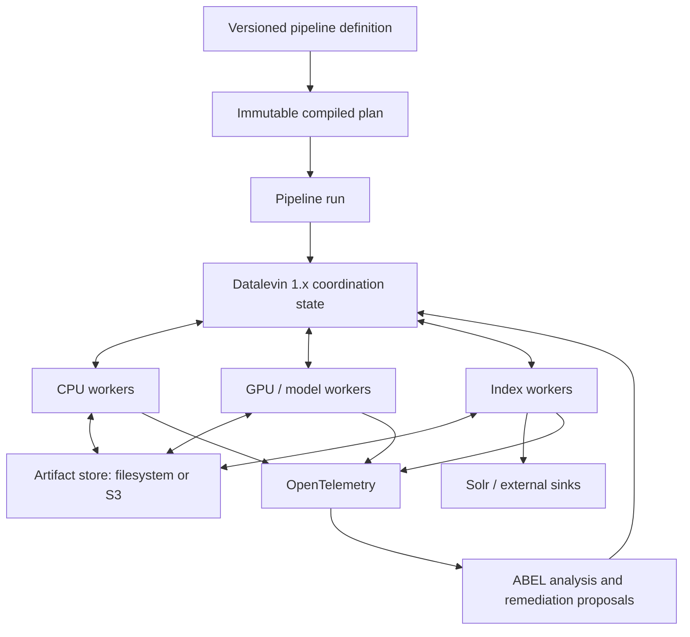

# Collet Next: a local-first execution fabric for large AI and search data jobs

## Why revive Collet

Collet should not return as another general-purpose ETL scheduler or conversational-agent framework. Its useful niche is reliable execution of large, expensive, data-oriented jobs that combine conventional processing with models, search systems, and external APIs.

The reference workload is intentionally demanding:

- discover and parse terabytes of profiles or documents;
- normalize records;
- enrich records through APIs and language models;
- generate embeddings in bounded batches;
- build and validate a Solr index;
- calculate features, score candidates, and evaluate rerankers;
- rerun work deliberately after data, code, prompt, or model changes;
- explain cost, failures, lineage, and operational bottlenecks.

The intended product is:

> A local-first, coordinatorless execution fabric for large AI and search data jobs, with reproducible runs, run-scoped handoff, dependency lineage, and built-in operational evidence.

“Coordinatorless” means there is no dedicated scheduler process assigning work. It does not mean there is no shared coordination state. In a distributed deployment, Datalevin is the authority workers use to discover, claim, and commit work.

## Preserve what is already good

The revival should retain Collet's strongest ideas:

- pipelines are declarative data that can be validated, versioned, diffed, and generated;
- a pipeline is a DAG of tasks;
- a task is an ordered sequence of actions;
- selectors and conditions connect configuration, inputs, and action state;
- actions are small, extensible integration and transformation units;
- virtual threads and bounded concurrency suit I/O-heavy workloads;
- the runtime remains useful as an embedded Clojure library and a local CLI.

Clojure remains the implementation language. It should not remain an adoption requirement: pipeline data, artifact contracts, telemetry, and future worker APIs should be language-neutral where practical. Datalevin 1.0 already exposes local and remote APIs in Clojure, Java, Python, and JavaScript, which removes one database-access barrier for future worker SDKs without defining the Collet worker protocol for us.

## Desired architecture


```mermaid
flowchart TB
    SPEC["Versioned pipeline definition"] --> PLAN["Immutable compiled plan"]
    PLAN --> RUN["Pipeline run"]

    RUN --> DLV["Datalevin 1.x coordination state"]
    DLV <--> CPU["CPU workers"]
    DLV <--> GPU["GPU / model workers"]
    DLV <--> IDX["Index workers"]

    CPU <--> ART["Artifact store: filesystem or S3"]
    GPU <--> ART
    IDX <--> ART
    IDX --> SOLR["Solr / external sinks"]

    CPU --> OTEL["OpenTelemetry"]
    GPU --> OTEL
    IDX --> OTEL
    OTEL --> ABEL["ABEL analysis and remediation proposals"]
    ABEL --> DLV
```

The architecture has four separate concerns:

1. **Definition and planning** — immutable pipeline specifications and compiled plans.
2. **Coordination** — durable run state, task/work-unit state, leases, attempts, and task dependencies in Datalevin.
3. **Data execution** — bounded Arrow batches, optional DuckDB SQL, and action execution inside workers.
4. **Artifact publication** — temporary run-scoped handoff plus explicit, user-owned publication to external systems.

None of these layers should become the hidden storage or execution model of another layer.

## Definition and run model

A pipeline definition is immutable and identified by a deterministic content hash. Compiling it produces an immutable execution plan without run IDs, statuses, results, executors, or callbacks.

The plan records stable executable identity for provenance. It explains which
pipeline, action, dependency, prompt, model, and schema produced an output; it
does not select an earlier output.

Each execution creates a run-owned ownership chain. Artifact UUIDs are new on
every execution, even when bytes happen to match:

```text
PipelineDefinition → PipelineRun → TaskRun → WorkUnit → Attempt
                                                       │
                                                       └── publishes → Artifact

TaskRun → depends on → TaskRun
```

The pipeline DAG should remain small. Large workloads must not create one task
entity per profile or document. #49 initially creates one work unit per task;
finer scheduling is not promised until a concrete workload establishes its
ownership and idempotency contract.

Compiled functions, live connections, executors, and callbacks are process-local and reconstructed by a worker. Durable state contains only serializable identity, lifecycle, policy, error, and reference data.

## Worker model

Workers are replaceable processes with declared capabilities, for example:

```clojure
#{:cpu
  :profile-parser
  [:embedding/model "bge-m3"]
  [:accelerator :cuda]
  :solr-indexer}
```

In the eventual distributed runtime, every worker follows the same pull-based loop:

1. Find ready work matching its capabilities.
2. Atomically claim it with a lease and fencing token.
3. Renew the lease while processing bounded units.
4. Write and validate output artifacts.
5. Commit completion using the current lease token and fence.
6. Make newly satisfied downstream work discoverable.

There is no central scheduler. Claiming, renewal, completion, failure, cancellation, and reconciliation are transactional state operations. Any eligible worker can perform reconciliation.

Execution is **at least once**. Worker death, lease expiry, network partitions, or coordination failover may duplicate computation. Correctness comes from fencing, immutable run-owned artifacts, and idempotent sinks—not from an “exactly once” claim.

## Datalevin's role

Datalevin stores coordination metadata, not workload payloads.

The coordination baseline is [Datalevin 1.0.0](https://github.com/datalevin/datalevin/blob/1.0.0/CHANGELOG.md#100-2026-07-20), released on 2026-07-20. It requires Java 25, which already matches Collet. The release turns several former infrastructure assumptions into available platform capabilities, but it does not remove the need for Collet's own work, artifact, and reconciliation semantics:

| Datalevin 1.0 capability | Collet decision |
|---|---|
| Attribute predicates, `:db/ensure`, CAS, and explicit-transaction timeouts | Enforce schema invariants and postconditions inside short claim, renewal, and commit transactions. Keep fencing tokens and idempotent external publication because database invariants do not fence external side effects. |
| WAL watermarks, transaction-log access, snapshots, and log GC | Use them for database health, lag, backup, and recovery evidence. Durable Collet entities remain the workflow source of truth; the transaction log is not a second job-event model. |
| Server, asynchronous read-only replicas, and consensus-lease HA | Use the server for shared workers and HA for production availability. Send all claims and commits to the write leader; replicas may serve stale-tolerant inspection and operational reads. |
| Server-safe query resolution and registered UDFs | Prefer data transactions, built-ins, CAS, and `:db/ensure`. Any custom server-side coordination function must be versioned, registered on every server, and readiness-checked before a node may lead; workers must not depend on arbitrary client-side Clojure resolution. |
| `datalog-kv` access to the underlying DLMDB store | A co-located sortable queue projection is now possible, but remains an optimization justified by profiling and rebuildable from Datalog. |
| Java, Python, and JavaScript API parity | Future non-Clojure workers can use supported Datalevin clients, but they still need a versioned Collet work-unit/artifact contract and SDK-level atomic operations. |

It should contain:

- normalized pipeline definitions and content hashes;
- runs, task runs, work units, attempts, and lifecycle transitions;
- dependency and lineage relationships;
- work-unit requirements, active lease owners, fencing tokens, and renewals;
- active artifact references, schemas, counts, and hashes;
- small statistics, outbox entries, and remediation proposals.

It should not contain terabytes of profiles, embedding matrices, large model responses, or search indexes.

Datalog is initially both the source of truth and the ready-work queue. Workers present their capabilities when claiming; a persistent worker registry or heartbeat model is added only when autoscaling or operational evidence requires it. Workers query indexed candidate work and claim it in an atomic transaction with a bounded timeout. Claim, renewal, and terminal commit transactions use schema predicates and `:db/ensure` where they make invalid states unrepresentable. Datalevin KV may later become a sortable queue projection only if profiling proves it necessary. That projection must remain disposable: every claim is revalidated against Datalog, stale entries are harmless, and the entire KV index can be rebuilt from authoritative state.

Datalevin 1.0 HA is single-writer. Its consensus control plane decides who may write, while followers replicate the leader's WAL asynchronously. HA requires WAL and defaults to the `:strict` durability profile, but a successful write is not a quorum-replication acknowledgement. The recovery model therefore must not assume every recently acknowledged coordination write survives permanent loss of the leader before a follower has pulled its tail. Durable artifacts and idempotent external publications are reconstructable inputs to reconciliation, not consequences that exist only because a run-state row says they do. Collet operations must monitor committed, durable, applied, follower, and authority-confirmed LSNs and make the accepted recovery-point window explicit.

Deployment grows without changing the conceptual model:

| Deployment | Run state | Artifacts | Execution |
|---|---|---|---|
| Local development | Embedded Datalevin 1.x | Local filesystem | One Collet process |
| Small team | Datalevin 1.x server; optional read-only replicas | S3-compatible store | A few pull-based workers |
| Cluster | Datalevin 1.x consensus-lease HA | Object storage | Autoscaled capability-specific workers |

When a worker participates in a shared deployment, an optional embedded Datalevin database is only a local journal. The shared database remains authoritative.

Datalevin 1.0 HA has static, operator-managed membership and requires an idempotent external fencing hook for promotion. It is neither multi-leader storage nor automatic elastic membership. These constraints belong in the deployment and upgrade runbooks. Read-only replicas and HA followers can reduce inspection load, but readiness queries that precede a claim may be stale; the leader-side claim transaction is always authoritative.

Datalevin 1.0 also includes document, full-text, vector, embedding, local-model, and MCP features. They do not change Collet's storage boundary. Collet may use selectively indexed documents for small, evolving control records after measurement, but workload documents, embeddings, model responses, and search indexes remain in artifact or serving systems.

True scale-to-zero still requires an external observer—such as Kubernetes/KEDA, a cloud event, or one sentinel—to start workers when work arrives.

## Data and artifact model

Dataset-valued data uses three distinct representations:

```text
Inside an action/task       Arrow RecordBatch stream
Task-local analysis         DuckDB relation or optional tech.ml.dataset view
Between tasks in one run    Direct run-owned Artifact reference
```

Workers must stream bounded Arrow record batches instead of loading whole datasets in JVM heap. `tech.ml.dataset` remains a convenient Clojure view, not the persisted schema authority. DuckDB provides optional SQL transformation, joins, filtering, aggregation, memory limits, and local spilling.

A task output needed by a dependant or marked `:keep-state` is published beneath
its owning run and task. Consumers depend on Store metadata, not an in-memory
result or a local filename:

```text
artifacts/runs/<run-id>/tasks/<task-id>/<artifact-id>/
  data.parquet | value.edn
  manifest.edn
```

`Artifact` is the only internal payload entity. It describes one validated
physical file and is referenced directly as `[:artifact/id ...]` by both scalar
and dataset task outputs. Artifact IDs are run-owned UUIDs. Checksums verify
immutable bytes; they are neither identities nor execution selectors. Local
paths are derived from the artifact root and the run, task, and artifact IDs
rather than persisted as independent metadata.

The accepted #45 decision selects **Parquet plus DuckDB** for Collet-owned
durable artifacts; see
[`ADR 0045`](docs/adr/0045-dataset-artifact-spike.md). Native Ubuntu Gate 1
proved that aligned Lance works under JDK 25, including version-pinned reopen,
pre-commit recovery, LocalStack, and offline deployment. In the one-GiB Gate 2
run, Lance met all five latency thresholds but used 2.07x Parquet's
process-cold peak RSS and changed about 2.13 GB for both add and replace versus
18.4/18.8 MB Parquet replacements. Those results fail the approved 1.25x RSS
and 0.75x amplification rules.

- **Parquet plus DuckDB** is the selected internal format. Reads use the artifact
  schema to restore `FLOAT[n]`, because the physical Parquet scan exposes
  `FLOAT[]`; benchmark writes use bounded 4,096-row groups.
- **Lance** is technically viable on the required native platforms, but its
  helper/native operational surface is not justified for internal immutable
  artifacts by this workload's RSS and column-evolution evidence. It remains an
  optional destination candidate in
  [#62](https://github.com/velio-io/collet/issues/62).
- **Arrow IPC** remains the default core streaming/interchange path. Publication
  converts it to Parquet in bounded batches; the transient IPC file is not the
  handoff contract.
- **DuckTape** may be an optional tech.ml.dataset view, but never the artifact
  contract.

For shared workers, #52 may introduce temporary S3-backed handoff and cleanup.
Explicit file and S3 sink actions remain user-owned persistence destinations;
internal cleanup never touches them.

Scalar outputs are strict, versioned EDN payloads. They use standard `#uuid`
and `#inst` tags plus fixed `#collet/...` readers only for values EDN does not
represent. They are files, not Datalevin values; large tabular results belong
in Parquet datasets.

## Artifact publication and recovery

Artifact publication precedes work completion:

1. Execute the task for this run; #48 has no predecessor selection.
2. Write the payload below a staging directory on the artifact filesystem.
3. Close and force it, calculate checksum and count metadata, write and force a
   versioned manifest, then validate it.
4. Atomically rename the directory to its immutable run/task/artifact path.
5. Atomically register artifact metadata, the task's direct output reference,
   `:task/outcome :computed`, and terminal task state in Datalevin.
6. Only that committed output reference may satisfy a downstream task.

A failure before rename leaves no final artifact. A failure after rename but
before the database transaction leaves a bounded, non-consumable orphan. #53
may later adopt a verified orphan only for the same run/work unit under a fresh
fence after #49 adds attempts and fencing; it does not select an earlier output.

External side effects follow the same fencing rule. Solr documents use stable IDs
and generation metadata; large index rebuilds target a new collection, validate
it, and switch an alias. At-least-once execution remains explicit.

After all task futures quiesce, terminal run finalization retracts ordinary task
output references and Artifact entities, then deletes their directories. A Store
transaction failure leaves metadata and files intact. A later filesystem failure
leaves an invisible orphan for #53 to reconcile. `:keep-state` delays release
only until the owning Context closes. Reopening a Context restores run state and
task dependencies, not payloads.

## Task dependency lineage and persistence boundary

Lineage is the persisted task dependency graph already expressed by
`:task/inputs`. No separate edge records are written. Given a task-run ID, the
Store can return its direct upstream or downstream task runs even after temporary
artifacts have been cleaned up.

This graph answers which tasks directly supplied or consumed a task's input. #55
adds executable identity for provenance independently of artifact retention. It
does not turn the dependency graph into a cache key or make an internal artifact
permanent.

Core snapshots, partition identities, predecessor carry-forward, record-level
scheduling, CDC, retention, and cross-run output sharing are outside the
foundation. Partitioned durable output belongs to an explicit file or S3 sink
once a real requirement establishes partition keys, path layout, overwrite and
idempotency rules, and supported formats. Such sink output is user-owned and is
never deleted by internal artifact cleanup.

## AI and search as first-class workloads

Collet should own reliable offline and asynchronous AI data processing, not interactive agent conversation state.

First-class concerns include:

- provider-neutral generation, embedding, reranking, transcription, and evaluation actions;
- structured input/output schemas;
- request batching, rate limits, retries, timeouts, and circuit breaking;
- token, request, latency, and monetary cost accounting;
- prompt, model, tokenizer, and schema versioning;
- provenance and executable identity for every derived value;
- quality gates, golden datasets, sampling, and human review;
- intentional reruns and bounded backfills after significant version changes.

Solr remains a serving system rather than becoming part of Collet's state store. Collet owns the repeatable offline work that produces embeddings, features, evaluation data, collections, and ranking-model publications.

## Observability and ABEL

Collet emits OpenTelemetry traces, metrics, and events for:

```text
pipeline run
  └── task run
       └── work-unit attempt
            └── action
                 ├── model/API request
                 ├── artifact operation
                 └── external sink operation
```

High-volume records should produce metrics and sampled diagnostics rather than one span per record by default.

ABEL consumes that evidence to detect bottlenecks, diagnose failures, and write remediation proposals back as data. The responsibility boundary is:

> Collet executes and records. ABEL observes, explains, and proposes. Collet policy decides what may change.

ABEL must not silently mutate a running pipeline. A meaningful change creates a new candidate pipeline version, is evaluated on representative data, runs as a bounded canary, and is promoted or rolled back under policy. Collet must continue operating when ABEL or the telemetry collector is unavailable.

## User experience

The local experience should remain the shortest path:

```text
collet validate
collet plan
collet run
collet inspect
```

Later commands such as `estimate`, `resume`, `replay`, and `backfill` should be added only when their runtime semantics exist.

EDN remains the native authoring format. A versioned intermediate representation may later support JSON/YAML frontends and non-Clojure clients without creating separate workflow languages.

Action dependencies should be modular. Trusted local execution may retain dynamic JVM dependencies and custom functions. Shared or multi-tenant deployments require pinned dependencies, explicit secret references, capability-restricted workers, network policy, and isolation for arbitrary code.

Clojure/JVM actions are the first worker implementation, not the permanent worker boundary. The artifact and work-unit contracts should later allow Python workers, OCI container jobs, HTTP actions, SQL jobs, and MCP tools to participate without moving large payloads through Datalevin. Datalevin 1.0's supported Java, Python, and JavaScript clients make this path more credible, but Collet still needs language-neutral claim and commit operations; it must not expose client-language transaction callbacks as the protocol. Cross-language support is added only for a real workload; it is not required to complete the local durable foundation.

## Product boundary

The architecture supports a clear product split from the original discussion:

- **Collet open source** — compiler, local runtime, embedded Datalevin, shared Datalevin worker mode, artifact contracts, standard actions, OTel instrumentation, and local CLI.
- **Enterprise distribution** — supported HA deployment, Kubernetes/autoscaling integration, isolated worker pools, SSO/RBAC, audit and retention policy, private networking, model/provider policy, upgrades, and support.
- **ABEL** — operational intelligence: bottleneck and failure analysis, cost attribution, anomaly detection, remediation policy, canaries, and pipeline comparisons.

Collet remains independently useful when ABEL is absent. A hosted Collet control plane is optional, not a requirement for execution. Customers should normally keep data and model-provider credentials in their own environment.

The immediate validation goal is not feature breadth or GitHub popularity. It is a real recurring bulk-AI/search workload where durable replay, selective backfill, cost control, or auditability removes enough custom operational code that a design partner will pay for the outcome.

## Foundation issue map

The current issues cover the local durable foundation and its first shared-worker
deployment. Dependency order matters more than issue number:

```text
#43 build/modules → #44 durable definitions and runs

#45 format spike → #46 Arrow type boundary → #48 run-scoped handoff
                                                ├──→ #47 DuckDB SQL action
                                                └──→ #49 claims/leases/attempts
                                                          ├──→ #51 retry/deadline/cancel
                                                          └──→ #52 S3/shared workers

#49 + #52 → #53 reconciliation/orphan adoption
#49 + #51 + #53 → #54 OpenTelemetry execution semantics
#45 + #46 + #48 + #49 + #51 → #55 custom-code isolation spike
```

- [#43](https://github.com/velio-io/collet/issues/43) modernizes the build and separates optional action dependencies.
- [#44](https://github.com/velio-io/collet/issues/44) separates immutable definitions from durable runs and introduces embedded Datalevin 1.x on the existing Java 25 baseline.
- [#45](https://github.com/velio-io/collet/issues/45) selected Parquet plus DuckDB for Collet-owned durable artifacts from aligned native Linux evidence.
- [#46](https://github.com/velio-io/collet/issues/46) implements the selected nested and extended Arrow type boundary.
- [#48](https://github.com/velio-io/collet/issues/48) establishes direct Parquet/EDN task-output handoff and terminal cleanup; every run computes its own outputs.
- [#47](https://github.com/velio-io/collet/issues/47) consumes #48's direct Parquet artifacts to add task-local DuckDB SQL; it is not a prerequisite for artifact publication.
- [#49](https://github.com/velio-io/collet/issues/49) initially creates one work unit per task and executes it through pull-based claims, leases, fencing, and durable attempts. It makes no partition-scheduling promise.
- [#51](https://github.com/velio-io/collet/issues/51) adds durable retry, backoff, deadline, and cancellation policy.
- [#52](https://github.com/velio-io/collet/issues/52) introduces temporary shared artifact transport and cleanup only when S3 becomes the second implementation.
- [#53](https://github.com/velio-io/collet/issues/53) may adopt a verified orphan only for the same active run/work unit under a fresh fence; terminal artifacts are cleanup candidates.
- [#54](https://github.com/velio-io/collet/issues/54) records `:computed` and `:adopted` execution outcomes, with no reuse or partition telemetry.
- [#55](https://github.com/velio-io/collet/issues/55) records executable identity for provenance and decides the trust/process boundary for custom code.

Optional post-foundation integration
[#62](https://github.com/velio-io/collet/issues/62) keeps Lance outside the
internal artifact path and tracks it as a versioned destination. It does not
block the foundation graph or reopen #45.

[#50](https://github.com/velio-io/collet/issues/50) is closed as premature.
Core snapshot and partition scheduling added complexity without an established
persistence requirement. A sink-specific issue should be created only when a
real workload defines its partition contract.

## Foundation gaps not yet scheduled

These are real boundaries, but they should become issues only after the current
foundation exposes their exact contracts:

- **Source discovery** — turn files, object listings, database cursors, or manifests into bounded source work without making core partition identities speculative.
- **External sink publication** — idempotent Solr/index publication, explicit delete propagation, validation, and alias promotion.
- **Datalevin 1.x operations** — store schema compatibility and migration, backup/restore, WAL snapshot and retention policy, explicit durability profiles, LSN/replica-lag monitoring, static HA membership, fencing hooks, and a tested recovery-point runbook.
- **Secrets and worker authorization** — secret references, least-privilege resolution, worker identity, and access to Datalevin, artifacts, providers, and sinks.
- **AI execution economics** — provider-neutral model calls, batching, rate limits, request caching, token/cost accounting, quality gates, and model/prompt version policy.
- **Orphan reconciliation** — identify terminal or uncommitted internal artifacts safely once attempts, leases, and fencing establish ownership.
- **Activation and autoscaling** — the external observer required for scale-to-zero, plus worker registration only if operationally necessary.

The control API, UI, richer scheduling, and ABEL remediation loop remain later product work rather than prerequisites for the durable execution core.

## Non-goals

Collet is not intended to become:

- a replacement for every general durable workflow engine;
- an interactive chat-agent framework;
- a data warehouse, object store, vector database, or search server;
- a distributed SQL engine or GPU scheduler;
- a hosted control plane required for execution;
- a system that stores workload payloads in Datalevin;
- a system promising exactly-once execution;
- a second implementation of capabilities already provided reliably by DuckDB, Arrow, Lance/Parquet, Solr, OpenTelemetry, or model providers.

## Success looks like

The architecture is working when one pipeline can process a multi-terabyte profile corpus and demonstrate all of the following:

- bounded memory at every worker;
- dynamic CPU, GPU/model, and indexing workers;
- recovery after killing workers without losing committed outputs;
- Datalevin leader failover preserves write authority, exposes any asynchronous-replication tail risk through LSN evidence, and lets reconciliation recover from durable artifacts within the documented recovery-point objective;
- no stale worker can publish obsolete results;
- each assigned task/work unit or model request records its own run-owned outcome;
- task dependency lineage remains inspectable after temporary payload cleanup;
- deletions are represented explicitly and reach external publications safely;
- nested profile data and embeddings retain their schemas;
- Solr publication is repeatable and safe to switch;
- cost and failure attribution is available per run, task, work unit, and model;
- every produced result has inspectable lineage back to exact input, code, schema, prompt, and model versions;
- the same pipeline starts locally and moves to shared infrastructure without changing its core specification.

That is the destination: keep Collet's declarative simplicity, but give it durable execution, artifact-native dataflow, AI/search economics, and an operational feedback loop.
