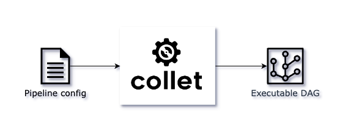
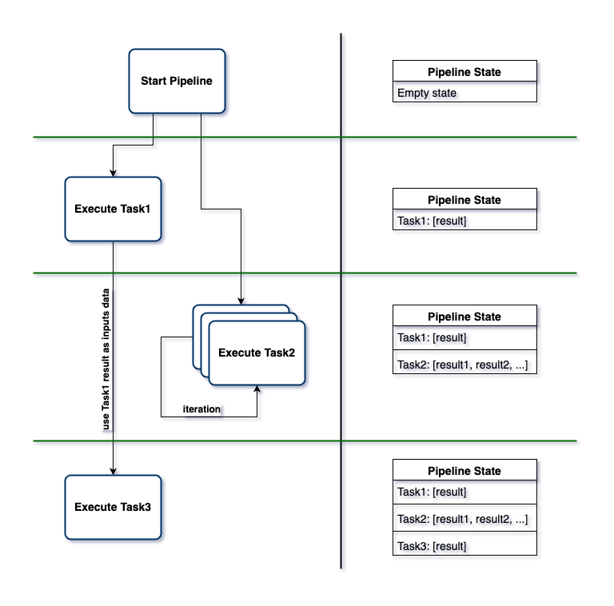

# COLLET

Collet is a powerful Clojure library designed to simplify the development and
execution of data processing pipelines (ETL or ELT).
It provides a declarative approach to defining task sequences and their dependencies,
making it easier to manage complex data workflows.



## Quick start

Pull the latest Collet image from DockerHub:

```shell
docker pull velio-io/collet:latest
```

Create a pipeline spec file `demo-pipeline.edn` with the following content:

```clojure
{:name  :demo-pipeline
 :tasks [{:name    :print-hello-world
          :actions [{:name   :print
                     :type   :clj/println
                     :params ["Hello, world!"]}]}]}
```

Run the pipeline using the following command:

```shell
docker run \
  -v "$(pwd)"/demo-pipeline.edn:/config/demo-pipeline.edn \ 
  -e PIPELINE_SPEC="/config/demo-pipeline.edn" \
  collet
```

Now you should see the output `Hello, world!` in the console.
Looks a little bit overcomplicated for such a simple task, right?
Stay tuned, it will make more sense as we dive deeper into the Collet features.

### Using Collet with Docker

Pull the latest Collet image from DockerHub:

```shell
docker pull velio-io/collet:latest
```

Or if you want to build Collet image from the source code, clone this repository:

```shell
git clone git@github.com:velio-io/collet.git && cd collet
```

Then build the image with the following command:

```shell
# on Linux
docker build -t collet .

# on MacOS
docker build --platform=linux/amd64 -t collet .
```

To run Collet, you need to provide a pipeline specification and optionally a pipeline config map.
These can be provided as environment variables in three ways:

1. As a raw Clojure map

```shell
docker run \
  -p 8080:8080 \
  -e PIPELINE_SPEC="{:name :my-pipeline ...}" \
  -e PIPELINE_CONFIG="{:my-secret #env SECRET_VALUE}" \
  collet
```

2. Local file (mount the volume with the pipeline spec)

```shell
docker run \
  -p 8080:8080 \
  -v ./test/collet:/app/data \
  -e PIPELINE_SPEC="/app/data/sample-pipeline.edn" \
  collet
```

3. S3 file:

```shell
docker run \
  -p 8080:8080  \
  -e PIPELINE_SPEC="s3://test-user:test-pass@test-bucket/test-pipeline-config.edn?region=eu-west-1" \
  collet
```

### Collet as a library

Add the following dependency to your project:

For Leiningen:

```clojure
[io.github.velio-io/collet-core "0.1.0"]
```

For deps.edn:

```clojure
io.github.velio-io/collet-core {:mvn/version "0.1.0"}
```

After adding Collet to your project dependencies, you can use it as follows:

```clojure
(ns my-namespace
  ;; require the collet namespace
  (:require [collet.core :as collet]))

;; define your pipeline
(def my-pipeline-spec
  {:name  :my-pipeline
   :tasks [...]})

;; precompile your pipeline
(def my-pipeline
  (collet/compile-pipeline my-pipeline-spec))

;; now you can run it as a regular Clojure function
;; also, you can provide a configuration map as an argument
;; pipeline will run in the separate thread and wouldn't block the calling thread 
(my-pipeline {:some-key "some-value"})

;; if you to wait for the pipeline to finish you can dereference returned future
@(my-pipeline {:some-key "some-value"})

;; another way to run the pipeline is to use the pipeline protocol
(collet/start my-pipeline {:some-key "some-value"})

;; pipeline is a stateful object, so you can stop, pause and resume it at any time
(collet/pause my-pipeline)
(collet/resume my-pipeline {:another-key "another-value"})

;; after stopping the pipeline you can't resume it
(collet/stop my-pipeline)

;; to get the current status of the pipeline or the pipeline error
(collet/pipe-status my-pipeline)
(collet/pipe-error my-pipeline)
```

### Pipeline Configuration

As mentioned before, when executing a Collet pipeline you can provide a configuration map,
which can be used to store sensitive data or any other configuration values.

It could be a regular Clojure map, e.g.

```clojure
{:db-user "my-user"
 :db-pass "my-pass"}
```

If you're using Collet Docker image you can provide this configuration as EDN file.
In this case Collet has a special reader for environment variables - `#env`.

Example:

```clojure
{:post-id           #uuid "f47ac10b-58cc-4372-a567-0e02b2c3d479"
 ;; refers to POSTGRES_JDBC_URL environment variable
 :postgres-jdbc-url #env "POSTGRES_JDBC_URL"
 ;; refers to REPORT_PATH environment variable, casts it to string and sets default value to ./reports/comments_sentiment_analysis.csv
 :report-path       #env ["REPORT_PATH" Str :or "./reports/comments_sentiment_analysis.csv"]
 :gc-access-token   #env "GC_ACCESS_TOKEN"
 :s3-bucket         #env "S3_BUCKET"} }
```

### Pipeline specification

Here's a complete example of a real world pipeline specification.
Don't worry if you don't understand everything at once, we will explain it step by step.

```clojure
{:name :comments-sentiment-analysis
 ;; include postgres jdbc driver as a runtime dependency
 :deps {:coordinates [[org.postgresql/postgresql "42.7.3"]
                      ;; also you can include a library with some prebuilt actions
                      [io.github.velio-io/collet-actions "0.1.0"]]
        ;; you'll need to require namaespaces with actions we're going to use
        :requires    [[collet.actions.jdbc-pg] ;; postgres specific bindings
                      ;; define the pipeline tasks
                      ;; first task will fetch all comments for the specific post from the postgres database
                      :tasks [{:name    :post-comments
                               :actions [{:name      :comments
                                          :type      :collet.actions.jdbc/query
                                          :selectors {post-id           [:config :post-id]
                                                      postgres-jdbc-url [:config :postgres-jdbc-url]}
                                          :params    {:connection {:jdbcUrl postgres-jdbc-url}
                                                      :query      {:select [:id :text]
                                                                   :from   :comments
                                                                   :where  [:= :post-id post-id]}}}]}

                              ;; second task will analyze the sentiment of each comment using Google Cloud NLP API
                              {:name     :comments-sentiment
                               :inputs   [:post-comments] ;; this task will depend on the previous one
                               :actions  [{:name      :for-each-comment
                                           :type      :mapper
                                           :selectors {post-comments [:inputs :post-comments]}
                                           :params    {:sequence post-comments}}

                                          {:name      :sentiment-request
                                           :type      :collet.actions.http/request
                                           :selectors {comment-text    [:$mapper/item :text]
                                                       gc-access-token [:config :gc-access-token]}
                                           :params    {:url          "https://language.googleapis.com/v2/documents:analyzeSentiment"
                                                       :method       :post
                                                       :oauth-token  gc-access-token
                                                       :content-type :json ;; send as json
                                                       :as           :json ;; read response as json
                                                       :body         {:encodingType "UTF8"
                                                                      :document     {:type    "PLAIN_TEXT"
                                                                                     :content comment-text}}
                                                       :return       [:documentSentiment]}}]
                               ;; returned data will be a map with keys :comment-id, :magnitude and :score
                               :iterator {:data [{:comment-id [:$mapper/item :id]
                                                  :magnitude  [:state :sentiment-request :documentSentiment :magnitude]
                                                  :score      [:state :sentiment-request :documentSentiment :score]}]
                                          ;; we will iterate over all comments one by one until there are no more comments
                                          :next [:true? [:$mapper/has-next-item]]}}

                              ;; third task will store the sentiment analysis report to the S3 bucket
                              {:name    :report
                               :inputs  [:comments-sentiment]
                               :actions [{:name      :store-report
                                          :type      :collet.actions.s3/sink
                                          :selectors {sentiments  [:inputs :comments-sentiment]
                                                      s3-bucket   [:config :s3-bucket]
                                                      report-path [:config :report-path]}
                                          :params    {:aws-creds   {:aws-region "eu-west-1"}
                                                      :input       sentiments
                                                      :format      :csv
                                                      :bucket      s3-bucket
                                                      :file-name   report-path
                                                      :csv-header? true}}]}]}
```

The basic structure of that can be represented as follows:

```clojure
{:name  :my-pipeline
 :deps  {...}
 :tasks [...]}
```

- `:name` (required): A keyword representing the pipeline name (in order to distinct results from multiple executions).
- `:tasks` (required): A vector of task maps.
- `:deps` (optional): A map for loading runtime dependencies (from maven or clojars). Check the deps
  format [here](./docs/deps.md).

One way you can think of a pipeline is a data structure that evolves over time.
When you initialize a pipeline it has some internal state of the shape `{:state {} :config {}}`.
Where the `state` key is an empty map and the `config` key is a map with the configuration values (provided an the
startup). When pipeline is running every task will contribute to the `state` key. The `state` key will contain
data returned from tasks. If a task executed multiple times, the `state` key will contain all the iterations data
as a sequence of task results (see `:state-format` option). Also, tasks can refer to each other data using the `:inputs`
key (will be fulfilled for each task individually).

In a nutshell, task is a logical unit of work that can be executed. Tasks can depend on other tasks, forming a Directed
Acyclic Graph. Task can be executed multiple times if it requires iteration over the data. Every task iteration will
contribute to the resulting pipeline state.



Each task map can contain the following keys:

- `:name` (required): A keyword that represents the name of the task
- `:actions` (required): A vector of maps, where each map represents an action
- `:setup` (optional): Similar to `:actions`, but runs only once before the main actions
- `:inputs` (optional): A vector of keywords that represents the input data for the task. Keywords should refer to other
  tasks names
- `:skip-on-error` (optional): a boolean value that represents whether the task should be skipped if an error occurs.
  Otherwise, the pipeline will stop on the first error.
- `:state-format` (optional): a keyword that represents how task data will be added to the pipeline state. Available
  options are `:latest` `:flatten`. In case of `:latest` value, pipeline state will contain only the last task iteration
  value. In case of `:flatten` value, pipeline state will contain all task iterations values as a flattened sequence.
- `:retry` (optional): A map that represents the retry policy. This map can contain the following keys:
    - `:max-retries` - how many times the task should be retried
    - `:backoff-ms` - a vector `[initial-delay-ms max-delay-ms multiplier]` to control the delay between each retry, the
      delay for nth retry will be `(min (* initial-delay-ms (expt 2 (- n 1))) max-delay-ms)`
- `:keep-state` (optional): a boolean value that represents whether the pipeline should keep the task state after the
  execution. Otherwise, the state will be cleaned up after the task execution if no other tasks referring to this data.
  Useful for debugging purposes.
- `:iterator` (optional): A map that represents the iteration of actions. If iterator is skipped, the actions will be
  executed only once. This map can contain the following keys:
    - `:data` - what part of the data should be treated as an task output
    - `:next` - responds to the question: should the iteration continue?

The most interesting part here is the `:iterator` key. It allows you to iterate over the data and execute the actions
multiple times. The `:data` key is a path to the specific part of the task state that should be treated as an output.
The value of the `:data` key should be a "path vector" (think of it as a vector for `get-in` Clojure function).
It might look like this:

```clojure
;; Here we're drilling down in the task state
{:data [:state :action-name :nested-key :more-nested-key]}
```

This path vector supports some additional elements like "map syntax", `:$/cat`, `:$/cond` and `:$/op` functions.
See the details [here](./docs/select-syntax.md).

If `:data` key is omitted, data returned from the last executed task will be treated as an output.

The `:next` key is responsible for the continuation of the iteration.
Setting it to true will mean an infinite loop, false - means no iteration at all.
Also, you can provide a "path vector" as for `:data` (but special syntax is not supported here) to point to the specific
part of the state. If value under this path is `nil` the iteration will stop.

```clojure
{:next [:state :action-name :nested-key]}
```

For more complex use cases you can provide a `condition vector`, which looks like this:

```clojure
{:next [:and
        [:< [:state :users-count] batch-size]
        [:not-nil? [:state :next-token]]]}
```

For more details on condition syntax see [here](./docs/condition-syntax.md).

### Collet Actions

Collet has a set of predefined actions, you can think of them as building blocks (functions) for your pipeline tasks.
Action is defined by its `type`. Type keyword refers to the specific function that will be executed.
List of predefined actions: `:counter`, `:slicer`, `:mapper`, `:fold`, `:enrich`

Here's an example of the `:counter` action:

```clojure
{:name   :events-count
 :type   :counter
 :params {:start 0
          :end   150
          :step  10}}
```

Apart from the predefined actions, you can define your own custom actions or refer to the Clojure core functions or
external libraries.

```clojure
{:name :my-custom-action
 :type :custom
 ;; you have to provide an implementation of the action
 :fn   (fn []
         (+1 2))}
```

```clojure
{:name      :query-string
 :type      :clj/format ;; refers to the clojure.core/format function
 :selectors {city [:config :city]}
 ;; params will be passed with apply function
 :params    ["area:%s AND type:City" city]}
```

Basic structure of the action map is:

- `:name` (required): A keyword that represents the name of the action
- `:type` (required): A keyword that represents the type of the action
- `:when` (optional): A condition vector that represents whether the action should be executed
- `:fn` (optional): If you want to define a custom action you can provide a regular Clojure function
- `:params` (optional): Represents the parameters (function arguments) for the action
- `:selectors` (optional): You can bind any value in the pipeline state to the specific symbol and refer to it in the
  params
- `:return` (optional): You can drill down to the specific part of the action output data and use it as a result

The `:selectors` key is a map of symbols (yes, only symbols should be used) and paths to the specific part of the state.
After that you can refer to these symbols in the `:params` key. They will be replaced with the actual values during the
action execution.
`:params` key could be a map (if only one argument is expected) or vector of positional arguments. If ommited, action
will be called without arguments.
`:return` is a path vector (with special syntax supported)

Also, Collet provides a separate package for more complex actions - `[com.github.velio-io/collet-actions "0.1.0"]`
This library contains such actions as `:collet.actions.http/request`, `:collet.actions.http/oauth2`,
`:collet.actions.odata/request`, `:collet.actions.jdbc/query`, `:collet.actions.s3/sink`, `:collet.actions.file/sink`,
`:collet.actions.queue/enqueue`

Check the [actions documentation](./docs/actions.md) for more details.

### Options for Docker container

Collet uses the mulog library for logging and tracing. When running as a Docker container,
you can configure various publishers using environment variables:

- `CONSOLE_PUBLISHER`: Enable console logging (default: false)
- `CONSOLE_PUBLISHER_PRETTY`: Use pretty formatting for console logs (default: true)
- `FILE_PUBLISHER`: Enable file logging (default: false)
- `FILE_PUBLISHER_FILENAME`: Set the filename for file logging (default: `tmp/collet-*.log`)
- `ELASTICSEARCH_PUBLISHER`: Enable Elasticsearch publishing (default: false)
- `ELASTICSEARCH_PUBLISHER_URL`: Set Elasticsearch URL (default: http://localhost:9200)
- `ZIPKIN_PUBLISHER`: Enable Zipkin publishing (default: false)
- `ZIPKIN_PUBLISHER_URL`: Set Zipkin URL (default: http://localhost:9411)

JMX metrics are exposed on port `8080` by default.
You can change this using the `JMX_PORT` environment variable.
