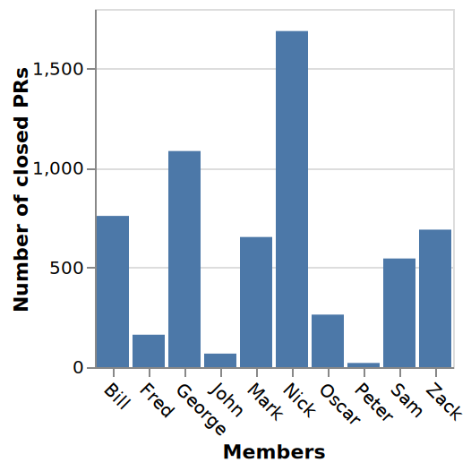
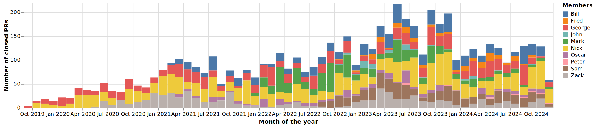

### Analysing the developers productivity based on the GitHub API

Pipeline specification: [github-productivity-pipeline.edn](github-productivity-pipeline.edn)

This sample pipeline demonstrates how to use the GitHub API to analyse 
the productivity of developers. The pipeline fetches all repositories 
of a provided organization and then fetches all pull requests of each repository.

The pipeline then calculates the number of pull requests made by each developer in total
and the split of pull requests made by each developer on the per month basis.

To run the pipeline, you need to provide the GitHub organization name and the GitHub access token.

```shell
docker run \
  -v "$(pwd)"/examples/github-developer-productivity:/data \
  -e PIPELINE_SPEC="/data/github-productivity-pipeline.edn" \
  -e PIPELINE_CONFIG="/data/pipeline-config.edn" \
  -e GITHUB_TOKEN="<your-github-access-token>" \
  -e GITHUB_ORG_NAME="<your-github-organization>" \
  collet
```

The pipeline then stores the results in a CSV file. 
You should be able to find them in the `report` folder after the pipeline execution.

You can use two Vega configuration files to visualize the results.
First Vega file [total-prs-distribution.vg.json](total-prs-distribution.vg.json) 
shows the total number of pull requests made by each developer.



The second Vega file [monthly-prs-distribution.vg.json](monthly-prs-distribution.vg.json) 
shows the split of pull requests made by each developer on the per month basis.

